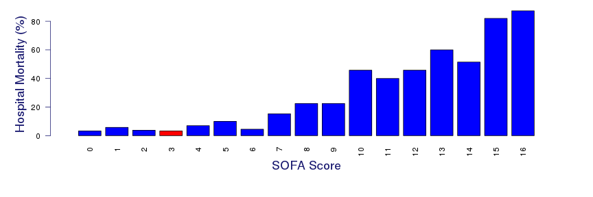
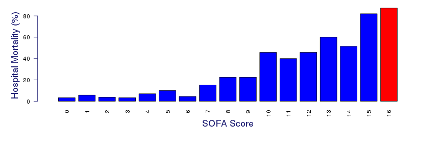

## Inspiration For This Site
Link to my Shiny App:
http://trevorw.shinyapps.io/SOFACalc/ 
The Sequential Organ Failure Assessment (SOFA) is used to track the a patients status while in the intensive care unit (ICU). The score is the conglomeration six different scores relating to: respiratory, cardiovascular, hepatic, coagulation, renal and neurological systems.
Each system is given a rank of 0 - 4, 4 being the worse.  They are then tallied to make a comined score. 
SOFA does not predict mortality, but does provide a mortality risk assessment. It was based on a study of 1449 patients from 40 intensive care units from around the world. The study followed patients over the age of 13 and who were in the ICU for longer than 48 hours. 
SOFA is based on the following study: 
http://www.ncbi.nlm.nih.gov/pubmed/9824069 
There are a couple examples of a SOFA Assesment Calculators on the web.  Here is one example: 
http://clincalc.com/IcuMortality/SOFA.aspx 

--- .class .mytable #id 

## Explanation of the Elements of the Score

<!-- html table generated in R 3.2.3 by xtable 1.8-2 package -->
<!-- Tue Mar 22 01:05:13 2016 -->
<table border=1>
<tr> <th>  </th> <th> Assesment </th> <th> Description </th> <th> Scoring </th>  </tr>
  <tr> <td align="right"> 1 </td> <td> FiO2 </td> <td> Fraction of inspired oxygen.  Normal air at sea level has 20.9% oxygen.  Enriched air can go up to 100% although it is typically capped at 50% to avoid oxygen toxicity. </td> <td> 20.9 - 100 </td> </tr>
  <tr> <td align="right"> 2 </td> <td> PaO2 </td> <td> Partial pressure arterial oxygen.  PaO2 describes the amount of oxygen dissolved in arterial blood plasma. The measurement is given as a pressure value (mmHg).  </td> <td> If PaO2 is > 80 mmHg, the patient has a normal value.  If PaO2 is < 80 mmHg, the patient has arterial hypoxemia. 79 - 70 mmHg = mild hypoxemia 69 - 60 = moderate hypoxemia 59 - 50 = severe hypoxemia < 50 = extreme hypoxemia </td> </tr>
  <tr> <td align="right"> 3 </td> <td> Mechanical ventilation </td> <td> Mechanical ventilation is a method to mechanically assist or replace spontaneous breathing. </td> <td> True/False </td> </tr>
  <tr> <td align="right"> 4 </td> <td> Urine Output Score </td> <td> This is the amount urine excreted during a 24 hour period. </td> <td> 500 mL/day or more = 0 200 - 500 mL/day = 3 200 mL/day or less = 4 </td> </tr>
  <tr> <td align="right"> 5 </td> <td> Platelets </td> <td> The platelet count is a lab test to measure how many platelets you have in your blood. Platelets are parts of the blood that help the blood clot. </td> <td> < 150 = 1 < 100 = 2 < 50 = 3  < 20 = 4 </td> </tr>
  <tr> <td align="right"> 6 </td> <td> Bilirubin </td> <td> Bilirubin us an orange-yellow pigment formed in the liver by the breakdown of hemoglobin and excreted in bile. </td> <td> 1.2–1.9 [> 20-32] = 1 2.0–5.9 [33-101] = 2 6.0–11.9 [102-204] = 3 > 12.0 [> 204] = 4 </td> </tr>
  <tr> <td align="right"> 7 </td> <td> Glasgow Coma Score </td> <td> The Glasgow Coma Scale is a neurological scale which gives a way of assessing the conscious state of a person. A patient is assessed and given a score between 3 (indicating deep unconsciousness) and 15 (Alert and awake) </td> <td> 3 (indicating deep unconsciousness) to 15 (Alert and awake) </td> </tr>
  <tr> <td align="right"> 8 </td> <td> MAP </td> <td> MAP is an average blood pressure in an individual.  An normal range is between 65 and 110 mmHg </td> <td> 69 and 110 mmHg </td> </tr>
  <tr> <td align="right"> 9 </td> <td> Vasopressors </td> <td> Drugs that causing the constriction of blood vessels. Includes: Dopamine, Dobutamine, Epinephrine, Norepinephrine </td> <td> While these are important, explaining the dosages is out of scope for the assignment.  Please feel free to play around with it though. </td> </tr>
  <tr> <td align="right"> 10 </td> <td> Creatinine </td> <td> Creatine is a compound formed in protein metabolism and present in much living tissue. It is involved in the supply of energy for muscular contraction. </td> <td> 1.2–1.9 [110-170] = 1 2.0–3.4 [171-299] = 2 3.5–4.9 [300-440] (or < 500 ml/d) = 3 > 5.0 [> 440] (or < 200 ml/d) = 4  </td> </tr>
   </table>
note: used R code to generate this table

--- .class .mytable #id 

## Example of Patient doing good

<!-- html table generated in R 3.2.3 by xtable 1.8-2 package -->
<!-- Tue Mar 22 01:32:41 2016 -->
<table border=1>
<tr> <th>  </th> <th> scorenames </th> <th> score </th>  </tr>
  <tr> <td align="right"> 1 </td> <td> PaO2:FiO2 Ratio Score </td> <td> 1 </td> </tr>
  <tr> <td align="right"> 2 </td> <td> Platelets Score </td> <td> 0 </td> </tr>
  <tr> <td align="right"> 3 </td> <td> Bilirubin Score </td> <td> 0 </td> </tr>
  <tr> <td align="right"> 4 </td> <td> Glasgow Coma Score </td> <td> 2 </td> </tr>
  <tr> <td align="right"> 5 </td> <td> Creatinine/Urine Output Score </td> <td> 0 </td> </tr>
  <tr> <td align="right"> 6 </td> <td> MAP Score </td> <td> 0 </td> </tr>
  <tr> <td align="right"> 7 </td> <td> Total </td> <td> 3 </td> </tr>
  <tr> <td align="right"> 8 </td> <td> Estimated mortality rate: </td> <td> < 10% </td> </tr>
  <tr> <td align="right"> 9 </td> <td> Observed mortality rate: </td> <td> 3.3 </td> </tr>
  <tr> <td align="right"> NA </td> <td>  </td> <td>  </td> </tr>
   </table>

 note: used R code to generate this table and barplot

--- .class .mytable #id 

## Example of Patient doing Bad

<!-- html table generated in R 3.2.3 by xtable 1.8-2 package -->
<!-- Tue Mar 22 01:35:46 2016 -->
<table border=1>
<tr> <th>  </th> <th> scorenames </th> <th> score </th>  </tr>
  <tr> <td align="right"> 1 </td> <td> PaO2:FiO2 Ratio Score </td> <td> 3 </td> </tr>
  <tr> <td align="right"> 2 </td> <td> Platelets Score </td> <td> 3 </td> </tr>
  <tr> <td align="right"> 3 </td> <td> Bilirubin Score </td> <td> 3 </td> </tr>
  <tr> <td align="right"> 4 </td> <td> Glasgow Coma Score </td> <td> 4 </td> </tr>
  <tr> <td align="right"> 5 </td> <td> Creatinine/Urine Output Score </td> <td> 4 </td> </tr>
  <tr> <td align="right"> 6 </td> <td> MAP Score </td> <td> 1 </td> </tr>
  <tr> <td align="right"> 7 </td> <td> Total </td> <td> 18 </td> </tr>
  <tr> <td align="right"> 8 </td> <td> Estimated mortality rate: </td> <td> > 90% </td> </tr>
  <tr> <td align="right"> 9 </td> <td> Observed mortality rate: </td> <td> 90 </td> </tr>
  <tr> <td align="right"> NA </td> <td>  </td> <td>  </td> </tr>
   </table>

 note: used R code to generate this table and barplot
